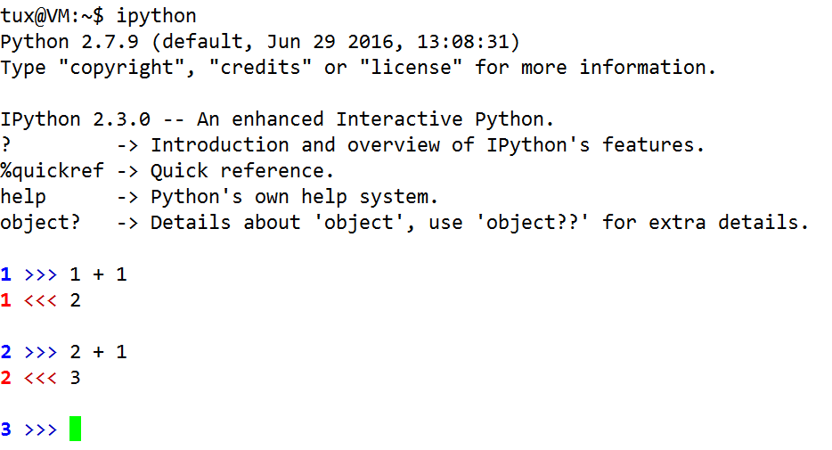
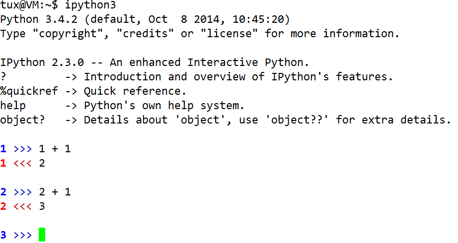

# python learn note

+ 安装 python
(安装 python-dev 解决pip安装出错)

```
# apt-get install python python-dev
```

* easy_install 安装

```
# apt-get install python-setuptools
```

* pip 安装(方便安装第三方库)

```
# apt-get install python-pip
```

+ ipython 自动补全的 python

```
# apt-get install ipython
```

+ 安装 scapy

```
# curl https://codeload.github.com/secdev/scapy/zip/v2.3.2
# unzip scapy-2.3.2.zip
# cd scapy-2.3.2/
# python setup.py install
```

+ Python 调用 shell 

`os.popen("shell command").read()` 适合只有一行输出的shell 命令


+ 其他

  + 更改 ipython 提示符

  

  ```
  $ ipython profile create #在当前目录下生成用户配置文件
  $ cd .ipython/profile_default/
  $ vim ipython_config.py
    ...
    c.PromptManager.out_template = '\\# <<< '
    ...
    c.PromptManager.in_template = '\\# >>> '
    ...
  ```
