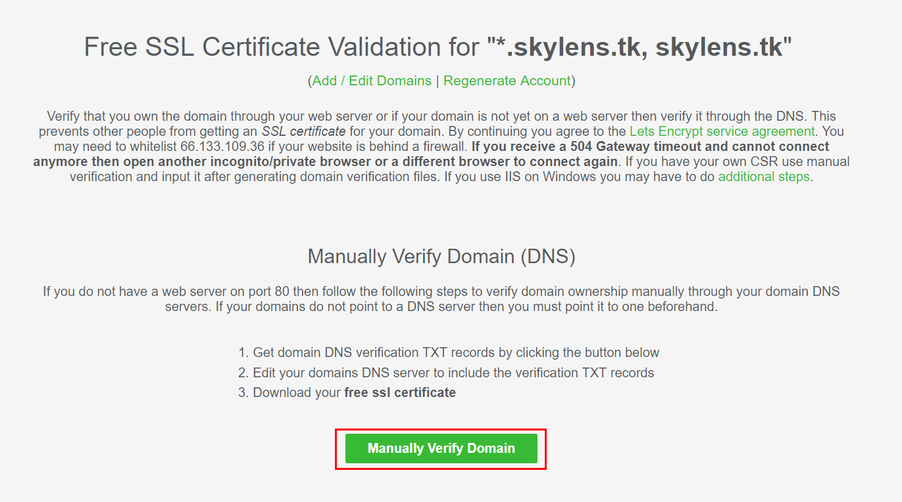
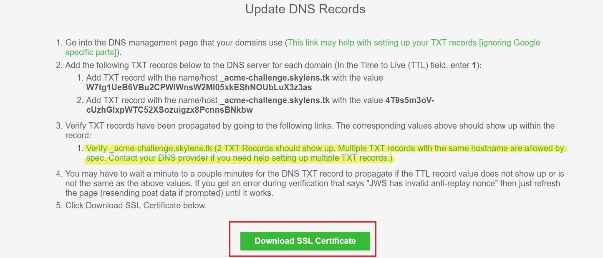
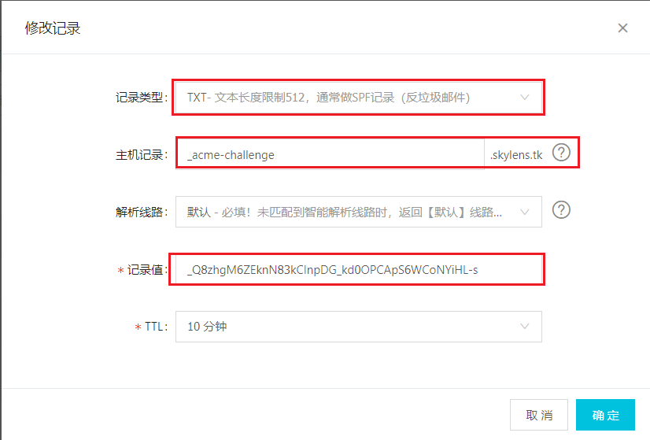
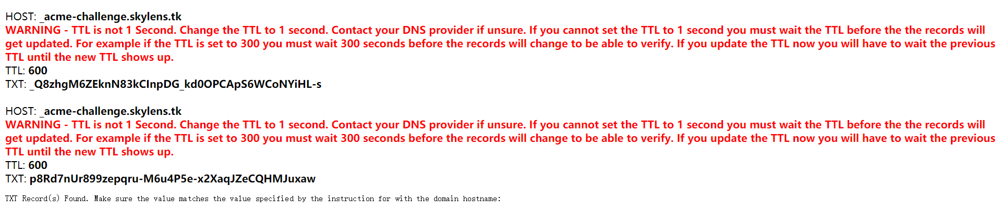
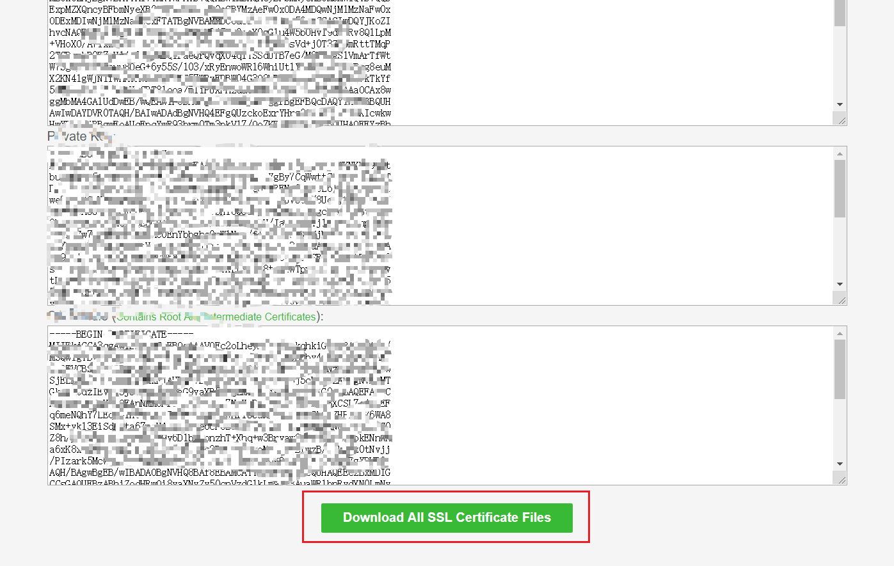

# `Nginx` 下 `HTTPS` 配置

## 使用在线 SSL 证书申请网站

[https://www.sslforfree.com/](https://www.sslforfree.com/)

sslfrofree 支持泛域名，可以申请泛域名证书，格式如下

`*.skylens.tk skylens.tk ` __注意空格，添加一级域名__


验证 `DNS`



更新域名解析记录，添加 `txt` 记录，并验证 `txt` 记录，如果记录存在，就可以下载证书了









下载下来的文件名为 `sslforfree.zip`，上传至服务器相应目录，解压

使用迪菲－赫尔曼密钥交换 ，生成`dhparam.pem` 文件

```
mkdir /etc/pki/nginx/ && cd /etc/pki/nginx/
openssl dhparam -out dhparam.pem 2048
```

示例配置文件：

```
server {
    listen 443 ssl http2;
    listen [::]:443 ssl http2;
    server_name skylens.tk;

    ssl on;

    ssl_certificate "/etc/pki/nginx/certificate.crt";
    ssl_certificate_key "/etc/pki/nginx/private.key";
    ssl_dhparam "/etc/pki/nginx/dhparam.pem";
    ssl_protocols TLSv1 TLSv1.1 TLSv1.2;
    ssl_ciphers ECDH+AESGCM:DH+AESGCM:ECDH+AES256:DH+AES256:ECDH+AES128:DH+AES:ECDH+3DES:DH+3DES:RSA+AESGCM:RSA+AES:RSA+3DES:!aNULL:!MD5:!DSS;
    ssl_session_cache shared:SSL:1m;
    ssl_session_timeout  10m;
    ssl_prefer_server_ciphers on;

    add_header Strict-Transport-Security "max-age=31536000; includeSubDomains;preload" always;
    add_header X-Frame-Options DENY;
    add_header X-Content-Type-Options nosniff;
    add_header X-Xss-Protection 1;
    
    ssl_buffer_size 8k;

    access_log /var/log/nginx/access.log;
    error_log /var/log/nginx/error.log;

   
    root  /usr/share/nginx/html;
    index  index.html index.htm;
    try_files $uri $uri/ =404;
    

    error_page  500 502 503 504  /50x.html;

    location = /50x.html {
        root  /var/www/html;
    }
}
```

