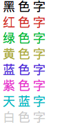

# shell 脚本中彩色输出

+ 效果



+ 初始化定义

```shell
# init colors
nocolor='\033[0m'
redcolor='\033[31m'
greencolor='\033[32m'
yellowcolor='\033[33m'
bluecolor='\033[34m'
purplecolor='\033[35m'
azurecolor='\033[36m'
```

用法示例：

```shell
#!/bin/bash

# init colors
nocolor='\033[0m'
redcolor='\033[31m'
greencolor='\033[32m'
yellowcolor='\033[33m'
bluecolor='\033[34m'
purplecolor='\033[35m'
azurecolor='\033[36m'

echo -e "I ${redcolor}Love${nocolor} You"
echo -e "I ${greencolor}Love${nocolor} You"
echo -e "I ${yellowcolor}Love${nocolor} You"
echo -e "I ${bluecolor}Love${nocolor} You"
echo -e "I ${purplecolor}Love${nocolor} You"
echo -e "I ${azurecolor}Love${nocolor} You"
```

+ bash 脚本

```bash
echo -e "\033[30m黑色字\033[0m"
echo -e "\033[31m红色字\033[0m"
echo -e "\033[32m绿色字\033[0m"
echo -e "\033[33m黄色字\033[0m"
echo -e "\033[34m蓝色字\033[0m"
echo -e "\033[35m紫色字\033[0m"
echo -e "\033[36m天蓝字\033[0m"
echo -e "\033[37m白色字\033[0m"
```

+ sh 脚本

```sh
echo "\033[30m黑色字\033[0m"
echo "\033[31m红色字\033[0m"
echo "\033[32m绿色字\033[0m"
echo "\033[33m黄色字\033[0m"
echo "\033[34m蓝色字\033[0m"
echo "\033[35m紫色字\033[0m"
echo "\033[36m天蓝字\033[0m"
echo "\033[37m白色字\033[0m"
```
