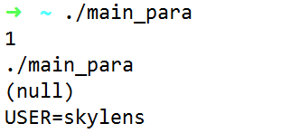
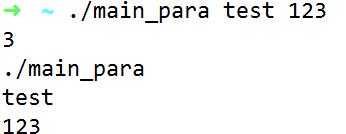
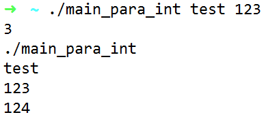

# C/C++ 问题

#### 1、 main 传递参数

```c
int main(int argc, char ** argv)
int main(int argc, char * argv[])
```

列子

```c
//main_para.c
#include<stdio.h>

int main(int argc, char * argv[]){
  printf("%d\n%s\n%s\n%s\n",argc,argv[0],argv[1],argv[2]);
}
```

运行结果



注意

_通过以上方式传递到main函数中的是字符串，有时候我们需要的是整型的数字而非字符型的数字，这时需要转换_

```c
//main_para_int.c
#include<stdio.h>

int main(int argc, char * argv[]){
  printf("%d\n%s\n%s\n%s\n",argc,argv[0],argv[1],argv[2]);
  int numbers = atoi(argv[2]);
  numbers++;
  printf("%d\n",numbers);
}
```

运行结果




