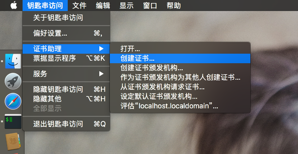
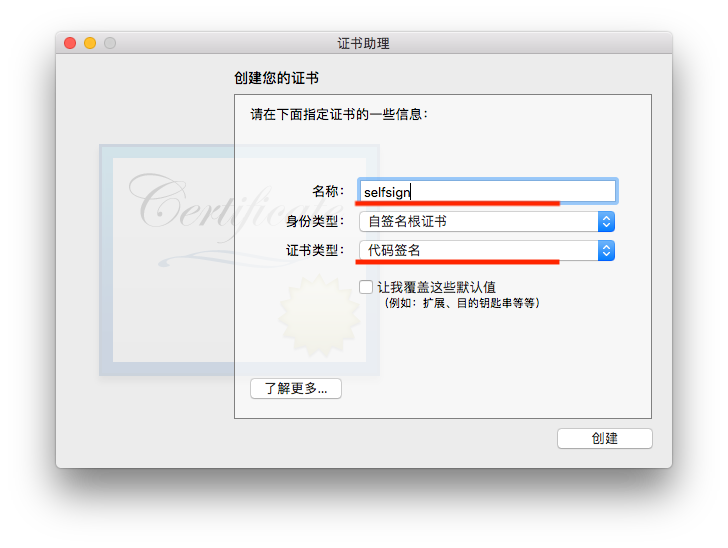
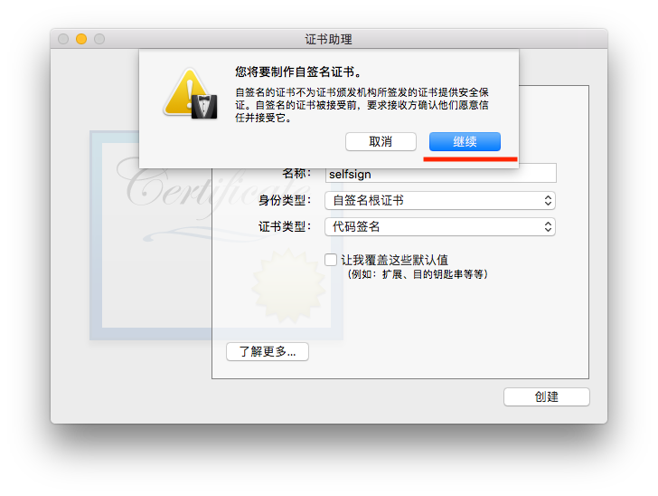
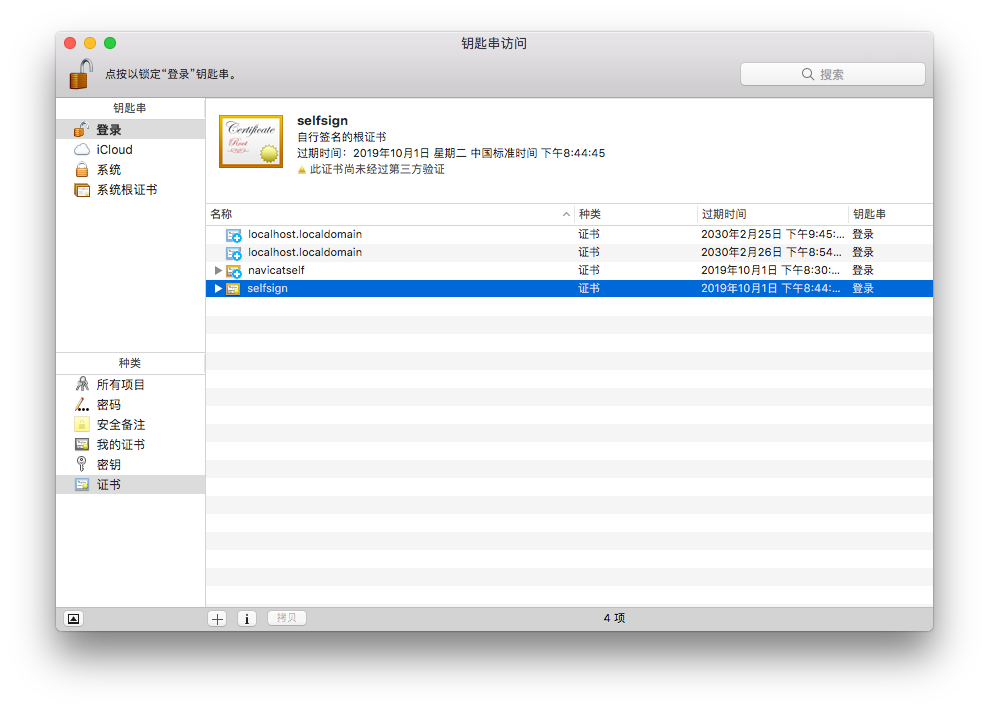
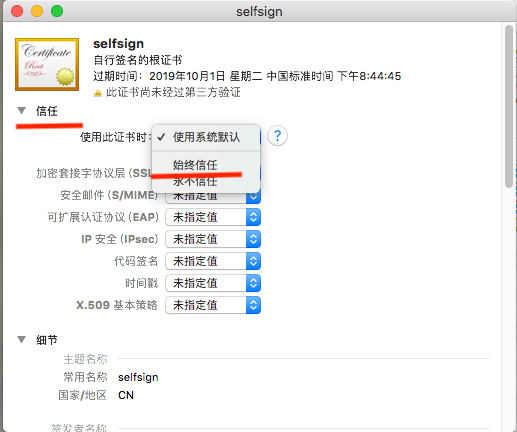

# macOS 生成自签名的代码签名证书

参考：[https://github.com/DoubleLabyrinth/navicat-keygen/issues/50#issuecomment-416824334](https://github.com/DoubleLabyrinth/navicat-keygen/issues/50#issuecomment-416824334)

### 钥匙串访问 (Keychains.app) -> 证书助理 (Certificate Assistant) -> 创建证书 (Create a Certificate)

### 名称 (避免空格) - 证书类型 (特别注意：代码签名)

### 双击证书，始终信任

