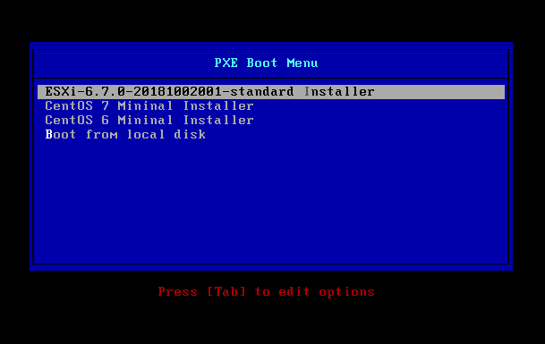
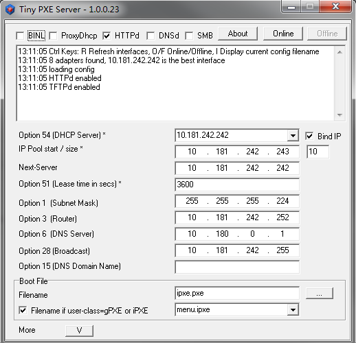
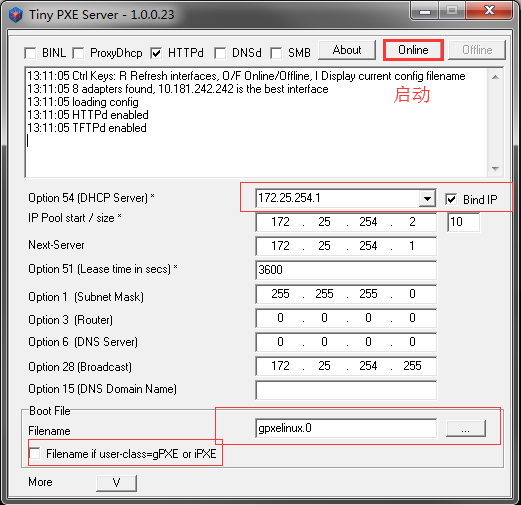

# 使用` Tiny PXE Server` 安装 `CentOS`、`EXSI`

## 前言

[https://blog.csdn.net/shouzang/article/details/80624660](https://blog.csdn.net/shouzang/article/details/80624660)

## 准备

1. [`Tiny PXE Server` (`pxesrv.zip`) http://erwan.labalec.fr/tinypxeserver/pxesrv.zip](http://erwan.labalec.fr/tinypxeserver/pxesrv.zip)
2. `syslinux` (`syslinux-3.86.zip`)
3. `VMware EXSI` 镜像 (`VMware-VMvisor-Installer-6.7.0.update01-10302608.x86_64.iso`)
4. `CentOS 7` 镜像 (`CentOS-7-x86_64-Minimal-1804.iso`)
5. `CentOS 6` 镜像 (`CentOS-6-x86_64-Minimal-1804.iso`)

## 配置 

1. 创建一个 `tftp`目录，位置随意，尽量选择磁盘空间大的盘 (根目录)

2. 解压 `syslinux`，将 `gpxe/gpxelinux.0` 及 `com32/menu/menu.c32`拷贝到 `tftp` 目录下

3. 在`tftp`目录下创建一个`pxelinux.cfg`目录

4. 在`tftp`目录下创建一个 `exsi6.7`目录，用于存放解压的 `exsi `镜像

5. 在`tftp`目录下创建一个 `centos7`目录，用于存放解压的 `centos 7`镜像

6. 在`tftp`目录下创建一个 `centos6`目录，用于存放解压的 `centos 6`镜像

7. 拷贝`exsi` 全部镜像文件到 `tftp/exsi6.7`目录下

8. `tftp/pxelinux.cfg`下创建名为 `default`的文件，内容如下：

   ```
   DEFAULT menu.c32
   MENU TITLE PXE Boot Menu
   NOHALT 1
   PROMPT 0
   TIMEOUT 80
   LABEL install
     KERNEL exsi6.7/mboot.c32
     APPEND -c exsi6.7/boot.cfg
     MENU LABEL ESXi-6.7.0-20181002001-standard ^Installer
   LABEL install
     KERNEL vmlinuz
     APPEND initrd=initrd.img text ks=http://172.25.254.1/centos7mininal_ks.cfg
     MENU LABEL CentOS 7 Mininal ^Installer
   LABEL install
     KERNEL vmlinuz
     APPEND initrd=initrd.img text ks=http://172.25.254.1/centos6mininal_ks.cfg
     MENU LABEL CentOS 6 Mininal ^Installer
   LABEL hddboot
     LOCALBOOT 0x80
     MENU LABEL ^Boot from local disk
   ```

   这个其实是引导菜单的配置文件

   

9. 修改 `exsi6.7/BOOT.CFG`配置文件

   ```
   bootstate=0
   title=Loading ESXi installer
   timeout=0
   prefix=exsi6.7/
   kernel=b.b00
   kernelopt=ks=http://172.25.254.1/exsi67_ks.cfg
   modules=jumpstrt.gz --- useropts.gz --- features.gz --- k.b00 --- chardevs.b00 --- user.b00 --- procfs.b00 --- uc_intel.b00 --- uc_amd.b00 --- uc_hygon.b00 --- vmx.v00 --- vim.v00 --- sb.v00 --- s.v00 --- ata_liba.v00 --- ata_pata.v00 --- ata_pata.v01 --- ata_pata.v02 --- ata_pata.v03 --- ata_pata.v04 --- ata_pata.v05 --- ata_pata.v06 --- ata_pata.v07 --- block_cc.v00 --- bnxtnet.v00 --- bnxtroce.v00 --- brcmfcoe.v00 --- char_ran.v00 --- ehci_ehc.v00 --- elxiscsi.v00 --- elxnet.v00 --- hid_hid.v00 --- i40en.v00 --- iavmd.v00 --- igbn.v00 --- ima_qla4.v00 --- ipmi_ipm.v00 --- ipmi_ipm.v01 --- ipmi_ipm.v02 --- iser.v00 --- ixgben.v00 --- lpfc.v00 --- lpnic.v00 --- lsi_mr3.v00 --- lsi_msgp.v00 --- lsi_msgp.v01 --- lsi_msgp.v02 --- misc_cni.v00 --- misc_dri.v00 --- mtip32xx.v00 --- ne1000.v00 --- nenic.v00 --- net_bnx2.v00 --- net_bnx2.v01 --- net_cdc_.v00 --- net_cnic.v00 --- net_e100.v00 --- net_e100.v01 --- net_enic.v00 --- net_fcoe.v00 --- net_forc.v00 --- net_igb.v00 --- net_ixgb.v00 --- net_libf.v00 --- net_mlx4.v00 --- net_mlx4.v01 --- net_nx_n.v00 --- net_tg3.v00 --- net_usbn.v00 --- net_vmxn.v00 --- nfnic.v00 --- nhpsa.v00 --- nmlx4_co.v00 --- nmlx4_en.v00 --- nmlx4_rd.v00 --- nmlx5_co.v00 --- nmlx5_rd.v00 --- ntg3.v00 --- nvme.v00 --- nvmxnet3.v00 --- nvmxnet3.v01 --- ohci_usb.v00 --- pvscsi.v00 --- qcnic.v00 --- qedentv.v00 --- qfle3.v00 --- qfle3f.v00 --- qfle3i.v00 --- qflge.v00 --- sata_ahc.v00 --- sata_ata.v00 --- sata_sat.v00 --- sata_sat.v01 --- sata_sat.v02 --- sata_sat.v03 --- sata_sat.v04 --- scsi_aac.v00 --- scsi_adp.v00 --- scsi_aic.v00 --- scsi_bnx.v00 --- scsi_bnx.v01 --- scsi_fni.v00 --- scsi_hps.v00 --- scsi_ips.v00 --- scsi_isc.v00 --- scsi_lib.v00 --- scsi_meg.v00 --- scsi_meg.v01 --- scsi_meg.v02 --- scsi_mpt.v00 --- scsi_mpt.v01 --- scsi_mpt.v02 --- scsi_qla.v00 --- shim_isc.v00 --- shim_isc.v01 --- shim_lib.v00 --- shim_lib.v01 --- shim_lib.v02 --- shim_lib.v03 --- shim_lib.v04 --- shim_lib.v05 --- shim_vmk.v00 --- shim_vmk.v01 --- shim_vmk.v02 --- smartpqi.v00 --- uhci_usb.v00 --- usb_stor.v00 --- usbcore_.v00 --- vmkata.v00 --- vmkfcoe.v00 --- vmkplexe.v00 --- vmkusb.v00 --- vmw_ahci.v00 --- xhci_xhc.v00 --- elx_esx_.v00 --- btldr.t00 --- esx_dvfi.v00 --- esx_ui.v00 --- esxupdt.v00 --- weaselin.t00 --- lsu_hp_h.v00 --- lsu_inte.v00 --- lsu_lsi_.v00 --- lsu_lsi_.v01 --- lsu_lsi_.v02 --- lsu_lsi_.v03 --- lsu_smar.v00 --- native_m.v00 --- qlnative.v00 --- rste.v00 --- vmware_e.v00 --- vsan.v00 --- vsanheal.v00 --- vsanmgmt.v00 --- tools.t00 --- xorg.v00 --- imgdb.tgz --- imgpayld.tgz
   build=
   updated=0
   ```

   主要是修改第3、4、5、6行的值

   第3行：设置 `exsi` 镜像的路径

   第4行：设置 `kernel`的位置

   第5行：设置`kickstart`应答文件的位置，`kicakstart` 应答文件(`exsi67_ks.cfg`)内容如下:

   ```
   # Accept the VMware End User License Agreement
   vmaccepteula
   # Set the root password for the DCUI and Tech Support Mode
   rootpw admin!123
   # Install on the first local disk available on machine
   install --firstdisk --overwritevmfs
   # Set the network to DHCP on the first network adapter
   network --bootproto=dhcp --device=vmnic0
   # Reboot after finish installation
   reboot
   ```

   第6行：去掉 `modules`前面的`/`

10. 拷贝`centos7\images\pxeboot\initrd.img`和`centos7\images\pxeboot\vmlinuz`到 `tftp`下

11. 添加 `centos` 的 `kickstart`文件

    ```
    # ks=http://10.181.242.242 net.ifnames=0 biosdevname=0 ksdevice=eth0
    #version=DEVEL
    
    # System authorization information
    auth --enableshadow --passalgo=sha512
    
    # Install OS instead of upgrade
    install
    
    #repo --name="CentOS" --baseurl=http://10.181.242.242
    #repo --name="base" --baseurl=http://mirrors.aliyun.com/centos/7/os/x86_64
    #repo --name="EPEL" --baseurl=http://mirrors.aliyun.com/epel/7/x86_64
    
    # Use CDROM installation media
    #url --url http://10.180.242.242/centos7
    url --url="http://mirrors.aliyun.com/centos/7/os/x86_64/"
    
    # Use graphical install
    text
    
    # Do not configure the X Window System
    skipx
    
    ignoredisk --only-use=sda
    
    # Keyboard layouts
    keyboard --vckeymap=us --xlayouts='us'
    
    # System language
    lang en_US.UTF-8
    
    # Network information
    network --bootproto=dhcp --device=eth0 --onboot=yes --ipv6=auto --activate
    network --hostname=redhat7.example.com
    
    # Root password
    rootpw --plaintext redhat
    #rootpw --iscrypted $6$h0IAL1u8DwZZ924e$8Qqj88eQA6GNC08.ePU3lNU1eT8bibiLlTh47SwrH7Wn5S34BTDdYkwx3lHGZXLgYrFVi0ilw5SqbFNSqE2jW.
    
    # System timezone
    timezone Asia/Shanghai --isUtc
    
    # System bootloader configuration
    bootloader --append="console=tty0 console=ttyS0,115200n8 crashkernel=auto" --location=mbr --boot-drive=sda
    
    # Clear the Master Boot Record
    zerombr
    
    # Partition clearing information
    clearpart --all --initlabel
    
    # Disk partitioning information
    # 1.LVM
    #part /boot --fstype="ext3" --ondisk=sda --size=1024
    #part pv.157 --fstype="lvmpv" --ondisk=sda --size=19455
    #volgroup centos --pesize=4096 pv.157
    #logvol / --fstype="ext4" --grow --maxsize=51200 --size=1024 --name=root --vgname=centos
    #logvol swap  --fstype="swap" --size=2047 --name=swap --vgname=centos
    # 2.normal
    #part /boot --fstype xfs --size 1024
    #part swap --size 1024
    #part / --fstype=xfs --grow --asprimary --size 10240
    # 3.autopart
    autopart --type=lvm
    
    # System services
    firstboot --disable
    # Selinux State
    #selinux --permissive
    #selinux --enforcing
    selinux --disable
    # Firewall State
    firewall --disable
    #firewall --enabled
    
    services --disabled="kdump,postfix" --enabled="network,sshd,rsyslog,chronyd"
    
    # Logg
    logging --level=info
    
    reboot
    
    %post --erroronfail
    yum -C -y remove linux-firmware
    %end
    
    %packages
    # @^minimal
    # @core
    # kexec-tools
    @core
    chrony
    firewalld
    grub2
    kernel
    net-tools
    kexec-tools
    nfs-utils
    bind-utils
    open-vm-tools
    rsync
    wget
    tree
    tmux
    telnet
    traceroute
    tar
    lrzsz
    vim
    yum-utils
    NetworkManager
    -aic94xx-firmware
    -alsa-firmware
    -alsa-lib
    -alsa-tools-firmware
    -biosdevname
    -iprutils
    -ivtv-firmware
    -iwl100-firmware
    -iwl1000-firmware
    -iwl105-firmware
    -iwl135-firmware
    -iwl2000-firmware
    -iwl2030-firmware
    -iwl3160-firmware
    -iwl3945-firmware
    -iwl4965-firmware
    -iwl5000-firmware
    -iwl5150-firmware
    -iwl6000-firmware
    -iwl6000g2a-firmware
    -iwl6000g2b-firmware
    -iwl6050-firmware
    -iwl7260-firmware
    -iwl7265-firmware
    -libertas-sd8686-firmware
    -libertas-sd8787-firmware
    -libertas-usb8388-firmware
    -plymouth
    
    %end
    
    %addon com_redhat_kdump --disable --reserve-mb='auto'
    
    %end
    
    %anaconda
    # pwpolicy root --minlen=6 --minquality=1 --notstrict --nochanges --notempty
    # pwpolicy user --minlen=6 --minquality=1 --notstrict --nochanges --emptyok
    # pwpolicy luks --minlen=6 --minquality=1 --notstrict --nochanges --notempty
    %end
    ```

12. 启动` Tiny PXE Server` (`pxesrv.exe`) 应用





## 目前支持 `bios` 引导，之后兼容 `uefi`
