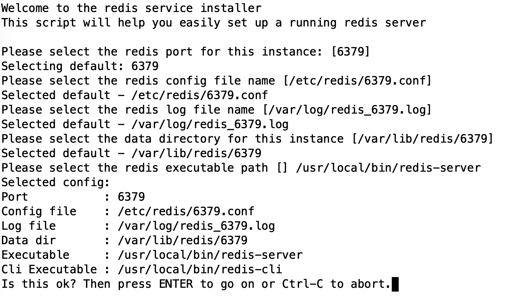

# Redis

## 安装 (CentOS 7)

```bash
sudo yum install -y gcc gcc-c++ wget
cd /tmp
wget http://download.redis.io/releases/redis-5.0.4.tar.gz
tar -xvf redis-5.0.4.tar.gz
cd redis-5.0.4/
make MALLOC=libc
make test
sudo make install
```

`sudo ./utils/install_server.sh`



## 启动

```bash
systemctl start redis_6379 ; systemctl status redis_6379
systemctl enable redis_6379
```

或者

```bash
/etc/init.d/redis_6379 start
/etc/init.d/redis_6379 status
```
